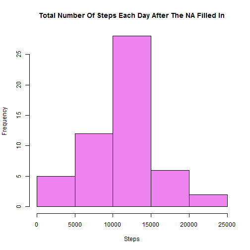

Activity monitoring
========================================================
#Loading and preprocessing the data

```r
library(knitr);
amdata <- read.csv("./activity.csv", header = TRUE);
namdata <- amdata[!is.na(amdata$steps), ];
namdata$date = as.factor(as.character(namdata$date));
```

#What is mean total number of steps taken per day

```r
histSteps <- tapply(namdata$steps, namdata$date, sum);
hist(histSteps, col = "violet", main = "Total Number Of Steps Each Day", xlab = "Steps");
```

 

```r
amMean <- mean(histSteps);
amMedian <- median(histSteps);
print(sprintf("The mean of total number of steps taken per day: %f", amMean));
```

```
## [1] "The mean of total number of steps taken per day: 10766.188679"
```

```r
print(sprintf("The meaian of total number of steps taken per day: %f", amMedian));
```

```
## [1] "The meaian of total number of steps taken per day: 10765.000000"
```

#What is the average daily activity pattern

```r
plotx <- as.numeric(levels(as.factor(namdata$interval)));
ploty <- tapply(namdata$steps, namdata$interval, mean, simplify = TRUE);
plot(plotx, ploty, type = "l", xlab = "5-minute interval", ylab = "average number of steps across all days", main = "The Average Daily Activity Pattern");
```

 

```r
print(sprintf("The %d 5-minute interval, on average across all the days in the dataset, contains the maximum number of steps.", plotx[which.max(as.numeric(ploty))]));
```

```
## [1] "The 835 5-minute interval, on average across all the days in the dataset, contains the maximum number of steps."
```

#Imputing missing values

```r
print(sprintf("The total number of rows with NA is %d.", 
    dim(amdata[is.na(amdata$steps), ])[1]));
```

```
## [1] "The total number of rows with NA is 2304."
```

```r
fillData <- namdata;
for (i in 1: dim(fillData)[1]) {
  if (is.na(fillData[i, ]$steps)) {
    fillData[i, ]$steps = mean(namdata[namdata$interval == 
                              fillData[i, ]$interval, ]$steps);
  }
}
histNSteps <- tapply(fillData$steps, fillData$date, sum);
hist(histNSteps, col = "violet", main = "Total Number Of Steps Each Day After The NA Filled In", xlab = "Steps");
```

 

```r
print(sprintf("The mean of total number of steps taken per day after the NA filled in: %f", mean(histNSteps)));
```

```
## [1] "The mean of total number of steps taken per day after the NA filled in: 10766.188679"
```

```r
print(sprintf("The meaian of total number of steps taken per day after the NA filled in: %f", median(histNSteps)));
```

```
## [1] "The meaian of total number of steps taken per day after the NA filled in: 10765.000000"
```

#Are there differences in activity patterns between weekdays and weekends

```r
library(chron);
library(Hmisc);
```

```
## Loading required package: grid
## Loading required package: lattice
## Loading required package: survival
## Loading required package: splines
## Loading required package: Formula
## 
## Attaching package: 'Hmisc'
## 
## The following objects are masked from 'package:base':
## 
##     format.pval, round.POSIXt, trunc.POSIXt, units
```

```r
fillData$weekday = "";
for (i in 1: dim(fillData)[1]) {
  if (is.weekend(as.POSIXct(fillData[i, ]$date))) {
    fillData[i, ]$weekday = "weekend";
  } else {
    fillData[i, ]$weekday = "weekday";
  }
}
fillData$weekday = as.factor(fillData$weekday);
plotfx <- as.numeric(levels(as.factor(fillData$interval)));
plotfy <- tapply(fillData$steps, fillData$interval, mean, simplify = TRUE);
xyplot(plotfy ~ plotfx | weekday, data = fillData, type = "l", layout = c(1, 2), xlab = "5-minute interval", ylab = "average number of steps across all weekdays", main = "The Average Daily Activity Pattern");
```

 
